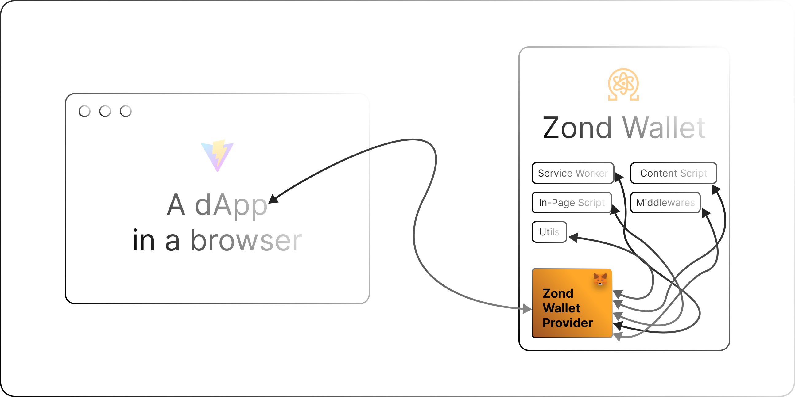

# Zond Wallet Provider

The Ethereum provider object announced by the [Zond Wallet](https://github.com/theQRL/zond-wallet), based on EIP-6963.

## :keyboard: Usage

- Run `npm i -D @theqrl/zond-wallet-provider` in your project to install the zond-wallet-provider package.
- Import the required function to the files.
